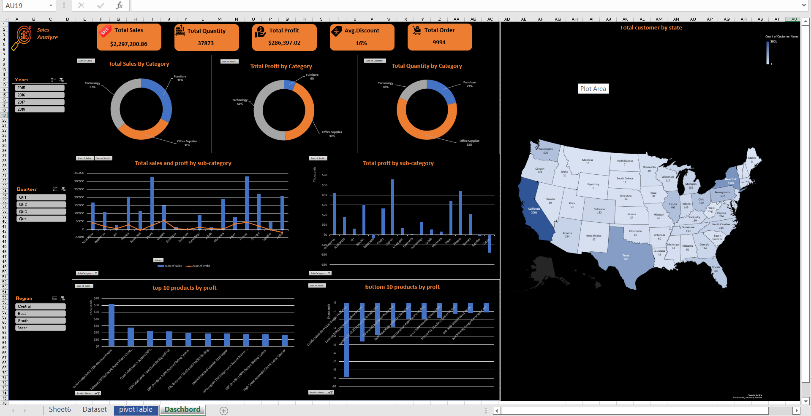

# Sales Data Analysis & Dashboard

## 📊 Project Overview
This project focuses on analyzing sales data using **Microsoft Excel**.  
The dataset includes detailed order information such as sales, profit, discount, and product categories.  
The goal of this project is to extract insights using pivot tables and visualize key performance indicators (KPIs) through a dashboard.

## 📂 Project Structure
- **Dataset**:  
  Contains raw transactional sales data with fields such as Order ID, Customer Name, Product Category, Sales, Quantity, Discount, and Profit.
  
- **PivotTable**:  
  Summarizes the dataset into meaningful insights, including:
  - Total Sales
  - Total Orders
  - Total Quantity Sold
  - Average Discount
  - Total Profit
  - Category-level analysis

- **Dashboard**:  
  An interactive Excel dashboard (prepared to be built on this sheet) that visualizes:
  - Sales performance trends
  - Profit distribution
  - Top-selling products
  - Category and sub-category insights

## 🚀 Key Features
- Data cleaning and preparation in Excel.
- Pivot table analysis for business insights.
- Dashboard structure to represent KPIs visually.
- Answers to analytical questions such as:
  - What are the total and average sales?
  - Which categories generate the highest profit?
  - What are the top 10 products by sales?

## 🛠 Tools Used
- **Microsoft Excel**
  - Pivot Tables
  - Data Analysis
  - Dashboard Visualization

## 📈 Insights & Outcomes
- Identified profitable and loss-making categories.
- Discovered the impact of discounts on profit.
- Ranked top products contributing to total sales.
- Provided a foundation for building dynamic Excel dashboards.

## 📌 Future Improvements
- Complete the interactive dashboard with charts and slicers.
- Automate data refresh for real-time analysis.
- Integrate with external data sources (e.g., CSV/Database).

---

